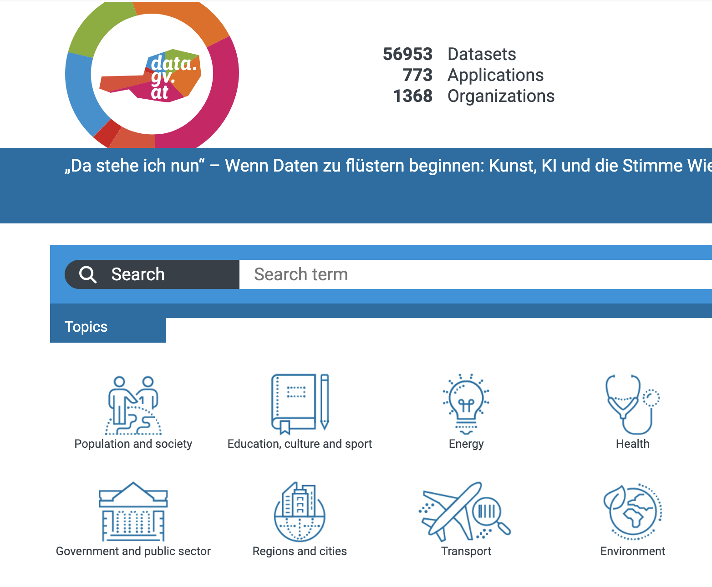

# 🎓 Master Thesis Topic Proposal  
## Political Influence and Everyday Life: A Data-Driven Analysis of Childcare Provision in Rural Austria

**Supervisor:** Alexander Jung, Associate Professor for Machine Learning
**Affiliation:** _Aalto University, Department of Computer Science_  

---

### 🧭 Motivation

In democratic Europe, we enjoy the freedom to choose our political representatives. But how do these political choices affect 
everyday quality of life in concrete, measurable ways? And conversely, what real-life needs shape our political preferences?

This thesis explores the connection between **local political representation** and the **provision of essential services**, using 
the availability of **childcare places in rural Austrian municipalities** as a case in point. The central idea is to analyze whether — 
and how — the local or regional political landscape supports or hinders investments in childcare infrastructure, especially outside urban centers.

---

### ❓ Research Questions

- How does the availability of childcare in rural areas correlate with political leadership at the municipal or state level?
- Are municipalities governed by certain political parties more likely to invest in expanding childcare services?
- Can changes in childcare provision be linked to changes in voting behavior or shifts in political control?
- What socioeconomic factors mediate this relationship (e.g., population aging, female labor participation, economic development)?

---

### 🧪 Methodology

This thesis adopts a **data-driven approach**, including:

- Data aggregation from open government datasets
- Statistical correlation and regression analysis
- Temporal comparisons (e.g., before/after election cycles)
- (Optional) Causal inference tools to assess policy effects

Tools: Python, pandas, geopandas, matplotlib, seaborn, and optionally statsmodels or scikit-learn.

---

### 📊 Main Data Source

The primary source for this research is Austria’s open government portal: [**data.gv.at**](https://data.gv.at/en/). Available datasets include:

- Number of publicly funded childcare places by municipality and year
- Demographic and labor market statistics (e.g., population structure, employment rates)
- Election results by municipality
- Political party control at municipal and regional level
- Spatial data (municipality boundaries and regional identifiers)

Other sources such as Statistik Austria or Eurostat may be used to complement this data.

---

### 🎯 Expected Outcomes

The thesis aims to quantify the relationship between political leadership and the availability of early childhood care. It may reveal patterns of political prioritization (or neglect) in rural Austria and help us better understand how governance shapes access to critical life services — with broader implications for voter behavior and trust in democratic institutions.

---

### ✅ Recommended Background

This topic is suitable for students with interests in:

- Political data science and public service analytics
- Social infrastructure and regional development
- Interdisciplinary research across political science, sociology, and data analysis

A strong foundation in Python and statistical methods is recommended.

---
